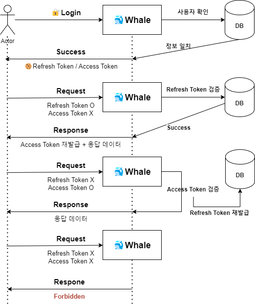

# 🐳 Whale 🐳
___

### 🛡️ Spring Security 를 활용한 JWT 인증 방식을 구현해보기
- [ ] ⚒️ User Domain 생성하기
- [ ] ⚒️ Spring Security Config 생성하기
- [ ] ⚒️ Jwt Filter 생성하기
    - Refresh Token 과 AccessToken 을 통한 인증 방식을 구현한다
    - Refresh Token 의 유효 기간을 길게, AccessToken 의 유효 기간을 짧게 설정한다
    - Refresh Token 을 Redis 에 저장한다

### 🔐 JWT 인증 진행 방식

토큰을 검사함과 동시에 각 경우에 대해서 토큰의 유효기간을 확인하여 재발급 여부를 결정한다

- 🐬 case1 : AccessToken 은 만료됐지만, RefreshToken은 유효한 경우 →  RefreshToken 을 검증하여 AccessToken 재발급
- 🐬 case2 : AccessToken 은 유효하지만, RefreshToken은 만료된 경우 →  AccessToken 을 검증하여 RefreshToken 재발급
- 🐬 case3 : AccessToken 과 RefreshToken 모두가 만료된 경우 → 에러 발생 (재 로그인하여 둘다 새로 발급)
