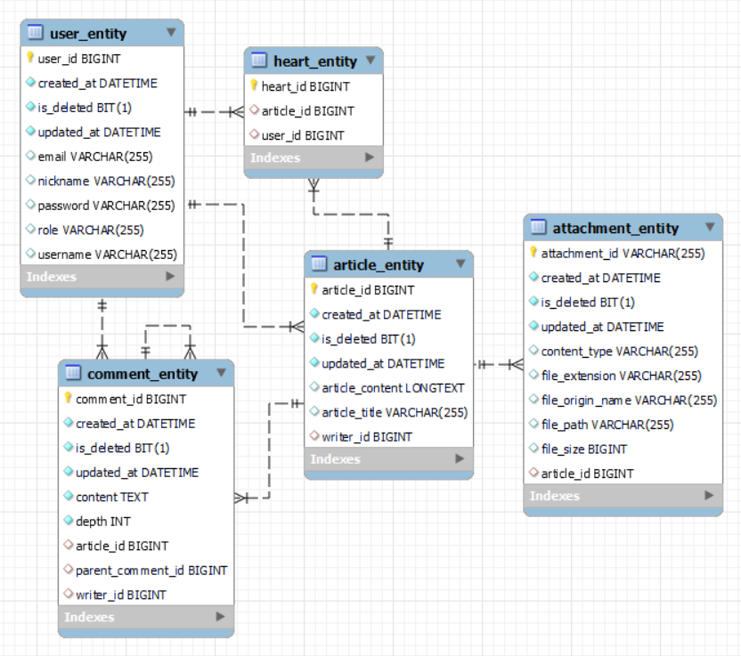

# 🐳 Whale 🐳
___

### 🛡️ Spring Security 를 활용한 JWT 인증 방식을 구현해보기
- [x] ⚒️ User Domain 생성하기
- [x] ⚒️ Spring Security Config 생성하기
- [x] ⚒️ Login 성공했을 때 토큰 발행하기
    - [x] ⚒️ AccessToken 을 응답 헤더에 담아서 전달하기
    - [x] ⚒️ RefreshToken 을 쿠키에 담아서 전달하기 
- [x] ⚒️ Jwt Filter 생성하기
    - Refresh Token 과 AccessToken 을 통한 인증 방식을 구현한다
    - Refresh Token 의 유효 기간을 길게, AccessToken 의 유효 기간을 짧게 설정한다
    - Refresh Token 을 Redis 에 저장한다
- [x] ⚒️ JsonUsernamePasswordFilter 에서 Login 이 성공적으로 마치면 RefreshToken 과 AccessToken 을 발급하여 전달한다
- [x] ⚒️ JwtAuthenticationFilter 에서는 요청과 함께 전달된 AccessToken 과 RefreshToken 의 유효성을 검증한다

### 🔐 JWT 인증 진행 방식

토큰을 검사함과 동시에 각 경우에 대해서 토큰의 유효기간을 확인하여 재발급 여부를 결정한다

- 🐬 case1 : AccessToken 은 만료됐지만, RefreshToken은 유효한 경우 →  RefreshToken 을 검증하여 AccessToken 재발급
- 🐬 case2 : AccessToken 은 유효하지만, RefreshToken은 만료된 경우 →  AccessToken 을 검증하여 RefreshToken 재발급
- 🐬 case3 : AccessToken 과 RefreshToken 모두가 만료된 경우 → 에러 발생 (재 로그인하여 둘다 새로 발급)

---

### ERD Table

---

